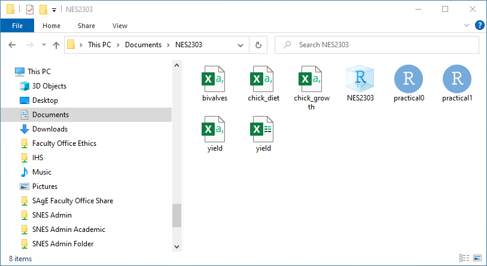

```{r setup, include=FALSE}
knitr::opts_chunk$set(echo = TRUE)
```

<style type="text/css">
span.boxed {
  border:5px solid gray;
  border-radius:10px;
  padding: 5px;
}
span.invboxed {
  border:5px solid gray;
  padding: 5px;
  border-radius:10px;
  color: white;
}
table, td, th
{
border:0px;
}
</style>


```{r, echo = FALSE, message=FALSE, warning= FALSE}
library(mosaic)
```

# Aims and objectives of Practical 1
The overall aim of this practical is to help you become more familiar with RStudio, and some basic summary statistics and visualisations. The specific objectives are to:

1. how to calculate simple summary statistics of the data you have imported into R
2. create some simple summary plots to aid interpretation
3. show you how these graphs and tables of calculated statistics can be exported to Microsoft Word and Microsoft Excel

We will primarily focus on two datasets:

**Chick data**

* `chick_diet.csv` contains the variables `weight`, `time`, `chick` and `diet`. It contains the weights of 45 individual chicks after a 21 day time period on 4 diets; A, B, C and D..
* `chick_growth.csv` contains the variables weight, time and diet. It contains the average weight of all the chicks on each day of the experiment, from day 0 (hatching) to day 21, for each of the same 4 diets.

**Bivalve data**

* `bivalve.csv` This contains the abundance of bivalves at two sites on four transects

Throughout this work you will be using the `mosaic` library, that you have already installed in "Practical 0", as it makes basic data summaries and graphics in R more straightforward

# Start RStudio, open your NES2303 project, create R script
If you did the first practical on 30th September 2022 this should be straightforward:

* Click on the Windows command button (bottom left of screen), type in RStudio and start the software
* Inside RStudio on the main menu click on **File -> Recent Projects -> NES2303**
* On the RStudio main menu click on **File -> New File -> R Script**

This should open a blank R script at the top left of your screen. Before you go any further, I suggest you type into your script a couple of lines of comments to explain what the script is being used for. As you will be using the `mosaic` R package you should also "activate" it to make its extra commands available, using the `library()` function. (If for any reason you were unable to install `mosaic` please speak to a demonstrator first):

```{r, eval = FALSE}
# Practical 1 : introduction to basic summary statistics and graphs using chick
# and bivalve data.

library(mosaic)
```

Position your cursor on `library(mosaic)` and hit the  <kbd>Ctrl</kbd> + <kbd>Enter</kbd>  key combination to send the command into the Console screen so that R executes it. You are likely to get several "Warning" messages, but don't worry about these. Only be concerned if a red "Error" message appears. Finally, before you go further, save your R script. 

* Look at the name of your R script. It is probably called `Untitled1.R`
* Also notice that its name is in red and that there is an asterisk, or * symbol, after its name, indicating it needs to be saved
* Click on the main RStudio menu and select **File -> Save**. You will be prompted for a name. Call your script **practical1.R**


# Typical Research Scientist Workflow
Whilst there are both biology and zoology students on this course, with a wide range of different interests, when doing your scientific research your "workflow" is likely to be quite similar:

1. Design, plan your laboratory experiment or field survey
2. Undertake your experiment or survey and collect your data
3. Enter data into Microsoft Excel, and save as CSV (comma separated value) format
4. Open your R Project, and start an R script, into which you can save R commands
5. Import your data from CSV file into R
6. Initial summary statistics and basic plots
7. More advanced analyses
8. Interpret results. Design new experiments or surveys if needed.
9. Export any graphs or tables from R to Microsoft Word
10. Write a report describing your findings

One of the reasons why R is so popular is that it allows you to do **reproducible** research. Several weeks or even months may pass between your data analyses (steps 6 and 7), and writing your report (step 10) but your R script will provide a complete record of what you have done. Indeed, even the final report can be written in R, to automatically include relevant graphs, data analyses etc. All the Microsoft Word documents on the NES2303 Canvas pages are actually written in RStudio, and auto-converted to Word, so I can skip Step 9 above!

# Download and import data
## Download data files
Go to Canvas and download `chick_diet.csv`, `chick_growth.csv` and `bivalves.csv` . Remember that when you download anything from a browser like Chrome or Edge, in general it will be stored in your "Downloads" folder. See the practical material for 30th September 2022 if you have forgotten the details. Therefore, before you can import the data, you need to copy it to your NES2303 project folder:

* Start the File Explorer from the Windows main menu
* Navigate to your downloads folder
* Hold down the <kbd>Ctrl</kbd> key and with your mouse, left-click on `chick_diet.csv`, `chick_growth.csv` and `bivalves.csv`. Holding down the <kbd>Ctrl</kbd> allows you to select multiple files
* Right click and select "Copy"
* Navigate to your "NES2303" folder, right-click in a blank area inside the NES2303 folder and select "Paste"

You should now see the following:



This folder now has quite a number of entries. Exact appearance may differ slightly, but the screenshot shows default Windows settings where the full name of a file is not displayed:

* `NES2303` (full name `NES2303.RProj`). Your RStudio Project settings created in the previous practical
* `bivalves`, `chick_diet` and `chick_growth` (full names `bivalves.csv`, `chick_diet.csv` and `chick_growth.csv`). The three data files in CSV format just downloaded from Canvas
* `practical0` and `practical1` (full names `practical0.R` and `practical1.R`). Your "script" files containing a record of your R commands.
* `yield` and `yield` with slightly different icons (full names `yield.csv` and `yield.xlsx`). The two data files you worked with in the initial practical, one in Microsoft Excel format, the other in CSV format

**Where should you store your data files?** For this course you should be fine storing your data in your NES2303 project folder, as you will only have a relatively small number of files to work with. In general, however, it is better to create a "Data" subfolder, and store all your data files there. This leads to less clutter and helps you be more organised. If you use this idea, simply add `Data/` before the data file name when you use the `read.csv()` command.

## Import your data into R
Go to your R script, called `practical1.R`, and edit it so that it reads as follows. Your script **must** contain comments, blank lines, spaces around the `<-` assign symbol etc so that it is readable!!

```{r, eval = FALSE}
# Practical 1 : introduction to basic summary statistics and graphs using chick
# and bivalve data.

library(mosaic)

# Read in data for chick diets and growth rates
diet_dat <- read.csv("chick_diet.csv")
growth_dat <- read.csv("chick_growth.csv")

```

```{r, echo = FALSE}
# Read in data for chick diets and growth rates
diet_dat <- read.csv("Data/chick_diet.csv")
growth_dat <- read.csv("Data/chick_growth.csv")

# Read in bivalve abundance data for 4 sites, 2 transects
bivalves_dat <- read.csv("Data/bivalves.csv")
```


Save your script by selecting **File -> Save** from the main RStudio menu. Next, position your mouse cursor on the first of the three `read.csv` lines, and hit the <kbd>Ctrl</kbd> + <kbd>Enter</kbd> key combinations several times to send the commands to the RStudio Console where they will be run. If you receive an error message, check you've copied the CSV files over from Downloads to your NES2303 project folder, look for any spelling errors (R is case-sensitive too), check you've typed `read.csv` and not `read-csv`, make sure you've surrounded the CSV filenames with opening and closing `"` symbols, and finally ask a demonstrator.


## Check your data has been imported correctly
The names of your three datasets, `diet_dat`, `growth_dat` and `bivalves_dat` should be displayed in the "Environment" pane at the top right. Double-click on any of them and you should see their contents. It is also worth running the `summary()` function to quickly check on column names, if their are any missing values coded `NA` etc. Add the following lines to your `practical1.R` script:

```{r}
# Quick check of newly imported data. Display summary information
# Summaries of chick data
summary(diet_dat)
summary(growth_dat)

# Summary of the bivalve abundance dataset
summary(bivalves_dat)
```

You should see summaries with minimum, maximum, median and means displayed for numeric variables, although not for character variables. **Question** the `bivalves_dat` table contains a column `site_sample` which is simply the sample code for each of three random samples taken at every site along one of the two transects. It has been coded `1`, `2`, `3`, but could just as easily have been coded `a`, `b`, `c`. Do you think means, minimum, maximum etc have any real value here?


**Other useful summary commands** As well as the `summary()` function, explore some other functions: `head()` `str()` `summary()` `nrow()` `ncol()` `names()`. Use these functions to answer the following questions about the data:

 1. What are the names of the variables(columns) in the `diet_dat` data frame?
 2. How many variables (columns) and how many observations (rows) each dataset? 
 3. How heavy is the heaviest chicken? And is this the same in both of the chick datasets?

**Reminder** Make sure to comment your script, using the `#` write some comments (notes) to annotate the script that you have just written so that you know what all the lines do, e.g.

```{r, eval = FALSE, echo= TRUE}
# Display the first few lines of the chick diet data
head(diet_dat)

# Inspect the structure of the data
str(diet_dat)

# Try the nrow(), ncol() and summary() functions
```

**In your own time**: repeat the process with the `growth_dat` and `bivalves_dat` tables of data until you are confident using these basic commands.


# Summary statistics
## Goal-oriented approach
Please have a look at the [Course Handbook](https://ncl.instructure.com/courses/23926/files/3203623?fd_cookie_set=1) on the Canvas website. You will see there that we are using a goal-oriented approach, where your goal can be a simple statistic, a data analysis or a graph. Let us start with some simple statistics on the `diet_dat` data. You will recall that in the goal-oriented approach we have:

&nbsp;

<center>
<h2><strong><span class="boxed">goal</span> ( <span class="boxed">y</span> ~ <span class="boxed">x</span> , data = <span class="boxed">mydata</span>, ... )</strong> 
</h2></center>

&nbsp;

where:

+ **goal** = What you want to do; a statistical summary, data analysis, or graph
+ **variable** = the name of the column containing the response variable
+ **group** = the name of the column containing an explanatory variable
+ **dataset** = the table of data (data frame) you are using
+ **...** = options

We can calculate some summary statistics to see if there are differences between chicks being fed different diets. So we can attempt our goal-oriented diagram to:

&nbsp;

<center>
<h2><strong><span class="boxed">simple statistic</span> ( <span class="boxed">chick weights</span> ~ <span class="boxed">diet</span> , data = <span class="boxed">diet_dat</span>)</strong> 
</h2></center>

&nbsp;

where:

+ **simple statistic** = the statistic that we want to calculate, e.g. mean, median, sd, etc.
+ **chick weights** = the weight of the individual chicks on the different diets at the end of the 21 day study. This is your **_response_** variable.
+ **diet** = the column describing which diet the chicks were fed. This is your **_explanatory_** variable as it should be obvious that diet might or might not determine chick weight, but the reverse  cannot true.
+ **diet_dat** = the table (data frame) of data containing the columns for chick weights and diets
+ **...** = options. This has been omitted as not needed in this first example

We can now replace the "simple statistic" above with what we want to calculate, and use the correct names `weight` and `diet` for the two columns in `diet_dat`. Add the following lines to the end of your `practical1.R` script and execute them:

```{r}
# Calculate arithmetic mean and medians for the chick weights
mean(weight ~ diet, data = diet_dat)
median(weight ~ diet, data = diet_dat)
```

The above two lines print the mean and median on the screen. If you do not remember the difference between means and medians, have a look at [Measures of Central Tendancy](https://naturalandenvironmentalscience.shinyapps.io/variation/#section-measures-of-central-tendency). You can also store the results of your mean and median in temporary variables `chick_mean` and `chick_med` for later re-use. Nothing is actually printed onto the screen when you store the data in `chick_mean` or `chick_med` variables but you can display it simply by entering the variable name in your script, or even the Console window (bottom left of RStudio) and hitting the Enter key:

```{r, echo = TRUE}
# Save means in temporary variable called chick_mean
chick_mean <- mean(weight~diet, data = diet_dat)

# Save medians in temporary variable called chick_med
chick_med <- median(weight~diet, data = diet_dat)
```

```{r, echo=TRUE, eval=FALSE}
# Display the contents of your temporary variables
chick_mean
chick_med
```


Both median, and especially mean, can be sensitive to outliers: move the sliders on the [interactive graphs](https://naturalandenvironmentalscience.shinyapps.io/variation/#section-sensitivity-to-outliers) to make sure you understand the effects of outliers. To get a good understanding of our data we need to calculate some statistics that give us an idea of how our data is **spread** about the mean. If this is unfamiliar to you go back over other sections of the interactive website tutorial linked above.

Thankfully because we are doing our analysis in R we don't have to calculate measures such as variance, standard deviation and standard error by hand, we can use functions to help us.

## Calculate the variance and standard deviation for each diet
Please look at [this explanation of variance, or var](https://naturalandenvironmentalscience.shinyapps.io/variation/#section-variance-correcting-ss-for-the-number-of-records) and [this explanation of standard deviation, or sd](https://naturalandenvironmentalscience.shinyapps.io/variation/#section-standard-deviation-correct-units) that introduce these measures of spread. If you do not understand variance and standard deviation, please speak to myself or one of the demonstrators. You can also use Microsoft Teams to send a message to all the demonstrators for advice.  Calculation is straightforward in R, using the functions `var()` and `sd()` and substituting them in as our "goals":

```{r}
# calculate the variance in chick weights on each diet
var(weight ~ diet, data = diet_dat)

# calculating standard deviation in chick weights on each diet
sd(weight ~ diet, data = diet_dat)
```

As before, rather than merely displaying these values on screen, we can put them into temporary R "objects" called  `chick_var` and `chick_sd` and assign the output of the `var()` and `sd()` functions to those objects. Again, the actual values are not displayed on screen when you store them in a temporary variable.

```{r}
# calculating variance for each group
chick_var <- var(weight ~ diet, data = diet_dat)

#calculating standard deviation for each group
chick_sd <- sd(weight ~ diet, data = diet_dat)
```

## Calculate standard error
Standard error is usually preferred to standard deviation when presenting summary statistics in graphs or tables, as it corrects for sample size. See [this part of the online website](https://naturalandenvironmentalscience.shinyapps.io/variation/#section-accuracy-and-precision) that explains the difference between "accuaracy" and "precision". Standard deviation measures accuracy, whereas standard error measures precision; see [this section on how to calculate standard error](https://naturalandenvironmentalscience.shinyapps.io/variation/#section-how-to-measure-accuracy-and-precision). It presents a simple equation to convert standard deviation: 

$$se = \frac{\sigma}{\sqrt{n}}$$

where:

* $se$ = standard error
* $\sigma$ = standard deviation, by convention shown with Greek letter _sigma_
* $\sqrt{n}$ = the square root of the number of samples

We have already calculated the variance and standard deviation, but for the calculation of se we need to know n, the number of observations in our group.
Again there is no need to count the number of observations in each group by hand, let's use the `favstats()` function which also computes some other useful measures that we might be interested in. The name `favstats()` refers to "favorite statistics"!

First, we store the results of all the commonly used statistics using `favstats()` in a temporary R table (data frame), which we'll call `fav_dat`:

```{r}
# create favourite statistics table of summary stats on each diet
fav_dat <- favstats(weight~diet, data = diet_dat)

# Inspect the contents of fav_dat
fav_dat
```

The results of your `favstats()` function are stored in a table (data frame) with several columns. Recall from last week that we can access single columns using the `$` sign. The column headed `n` contains the number of observations, and you need this in order to convert standard deviations into standard errors. To calculate se we want R to use `fav_dat$n` in our calculation, we can substitute this as well as the values that we already calculated for sd `chick_sd` into the equation

```{r}
# Calculate standard error from standard deviation and square root of number of samples
chick_se <- chick_sd/(sqrt(fav_dat$n))
```

**Note:** It is important to modify your `Practical_1.R` script as you go along, adding additional comments using `#` symbols, so that if you come back after 6 months you will still understand the R script. Add some notes about the above commands as comments to demonstrate that you understand what each bit is doing.

Finally, if you want to add your new `chick_se` variable onto the end of your `fav_dat` table as a new column, you can easily do this using the `cbind()` ("column bind") function. Notice how `fav_dat` is on both sides of the `<-` symbol as we are going to overwrite the old table with the new one:

```{r}
# Add the additional column of data to the table fav_dat
fav_dat <- cbind(fav_dat, chick_se)
# Display the revised table
fav_dat
```


## Assemble all your summary statistics into a new table 
The `fav_dat` table contains rather a lot of information, some of which we don't need, and a more concise table would be useful. We have created summary statistics with mean, median, variance, standard deviation and standard error. It would be useful to put them all into one table, or data frame. This is easy to do using the (you guessed it!) `data.frame()` function:

 + `chick_mean`
 + `chick_med`
 + `chick_var`
 + `chick_sd`
 + `chick_se`

```{r}
# Assemble all the summary statistics on chick diets into one table
diet_stats <- data.frame(chick_mean,
                         chick_med,
                         chick_var,
                         chick_sd,
                         chick_se)

# Display the table contents
diet_stats
```


Now you have a data frame `diet_stats` that contains summary statistics describing your dataset that might be useful in a report. The different diet codes are actually stored in the "row names" of the `diet_stats` table. Sometimes you'll find it more useful to explicitly put these categorical variables into a column, especially when plotting data. This is easy to do:

```{r}
# Add a column that contains the diet codes currently stored as row names
diet_stats$diet <- row.names(diet_stats)
# Notice how the diet codes now also appear in a column
diet_stats
```


# Basic summary plots
## Goal-oriented philosophy
We can use exactly the same goal-oriented philsophy when developing graphs as with basic statistic described above. For example, if you want to plot one variable against another:

&nbsp;

<center>
<h2><strong><span class="boxed">plot type</span> ( <span class="boxed">variable y</span> ~ <span class="boxed">variable x</span> , data = <span class="boxed">mydata</span>, ... )</strong> 
</h2></center>

&nbsp;

+ **Plot type** = This is your "goal", in other words a graph.
+ **Variable y** = (optional) The value to be plotted on the vertical y-axis, usually your "response" variable
+ **Variable x** = Value plotted on horizontal axis, usually your "explanatory" variable, either categorical or continuous
+ **Dataset** = Typically a table (data frame)
+ **...** = Options to control colours, groupings etc.

Here your y-variable is plotted on the vertical axis, and your x-variable on the horizontal axis. There may also be times when you only want to plot **one** variable, for example a frequency histogram, or a count of the number of observations. In this case the pattern is as follows, with the `variable` plotted on the horizontal axis, and the vertical axis (e.g. frequency or count) calculated automatically:

&nbsp;

<center>
<h2><strong><span class="boxed">plot type</span> (~ <span class="boxed">horizontal axis variable</span> , data = <span class="boxed">mydata</span>, ... )</strong> 
</h2></center>

&nbsp;

Because we are using the `ggformula` package the plotting functions that we will use will be preceded by `gf_` (graphics formula) so for a boxplot we will use `gf_boxplot()` for a bar chart we use `gf_bar()`, for scatter points `gf_point()` etc. There are links to additional information about `ggformula` on the Canvas website. Plot types you are likely to find particularly useful include:

* `gf_point()` Scatter plot
* `gf_line()`  Line plot
* `gf_histogram()` Frequency histogram
* `gf_bar()` Bar charts
* `gf_boxplot()` Boxplot
* `gf_violin()` Violin plots
* `gf_line()` Line plots

You can also overlay plotting elements on top of each other, change colours, axis titles, add legends etc. There are many different plotting options. In your own time, look at [this interactive website](https://naturalandenvironmentalscience.shinyapps.io/Summary_vis/#section-introduction) for a wide range of example plots.

## Plotting one variable
### Frequency histogram
This is probably the most common type of single variable graph you will create. It shows the frequency (i.e. count of 
numbers of cases) on vertical y-axis for a continuous numeric variable on horizontal x-axis. The frequency is calculated for you automatically. Let's look at the overall frequency histogram of your chick weights. Add the following lines to the end of your `practical1.R` script, save it. **Note** Remember to leave a few blank lines in your `practical1.R` script before beginning the commands for this plot, to make your script more readable. Run the new lines by hitting the <kbd>Ctrl</kbd> + <kbd>Enter</kbd> key combinations as usual:

```{r}
# Create a frequency histogram of chick weights
gf_histogram(~weight, data=diet_dat)
```

You can see that across all four diets combined, the most common chick weights are around 200g, although there is quite a lot of variation from less than 100g to over 350g.

### Chain plot commands to improve graphs
After you have created a basic plot, you will often want to improve it. I recommend do this sequentially, i.e. get your basic plot displayed, then gradually add extra lines of R code to improve it. Taking the above bar chart, the labels on the horizontal and vertical axes should be better. To chain a series of plot commands together we slightly tweak our original template to:

&nbsp;

<center>
<h2><strong><span class="boxed">plot type</span> ( <span class="boxed">y</span> ~ <span class="boxed">x</span> , data = <span class="boxed">mydata</span>, ... ) <span class="boxed">%>%</span></strong> 
</h2></center>

&nbsp;
&nbsp;

<center>
<h2><strong><span class="boxed">plot extras</span> ( <span class="boxed">additional plot options</span>)</strong> 
</h2></center>

&nbsp;

where:

* **%>%** = read as "then" or "go on and add". It is sometimes called a "pipe" symbol
* **plot extras** = what needs to be added or changed on the plot. e.g. add axis labels
* **additional plot options** = specifics for the plot extras, e.g. contents of axis labels

Let's begin by improving the axis labels, then getting rid of the miserable grey background to the plot. To modify the axis labels we use the `gf_labs()` function, specifying the contents of the horizontal (x) and vertical (y) axis labels. Add the following lines of code to your `practical1.R` script noting:

1. add the pipe symbol `%>%` to the end of your existing `gf_bar()` line
2. indent the start of your `gf_labs()` line by a couple of spaces. RStudio should do this automatically - it makes your code more readable.

```{r}
# Create a frequency histogram of chick weights
gf_histogram(~weight, data=diet_dat) %>% 
  gf_labs(x = "Chick weight (g)", y = "Number of birds")
```

Next, we will add an additional chain symbol `%>%` to modify or "refine" the "theme" or overall appearance using `gf_theme()`. A good general theme you will find suitable for most of your work is the "classic" theme, `theme_classic()`, which is a simple yet clear style. I do **not** recommend the default miserable grey background for reports etc:

```{r}
# Create a frequency histogram of chick weights
gf_histogram(~weight, data=diet_dat) %>% 
  gf_labs(x = "Chick weight (g)", y = "Number of birds") %>% 
  gf_theme(theme_classic())
```

### Smoothed density plots
Often if your sample size is relatively small it can be difficult to understand the patterns in your frequency histogram. A simple solution is to create a smoothed probability "density" curve for your data, making the overall shape easier to understand. We can use the `gf_density()` function. The vertical axis contains probabilities for each possible weight, so the `gf_labs()` also needs updating:

```{r}
# Create a probability density plot of chick weights
gf_density(~weight, data=diet_dat) %>% 
  gf_labs(x = "Chick weight (g)", y = "Probability density") %>% 
  gf_theme(theme_classic())
```

Building up graphs from simple to more complex ones like this by "chaining" commands together is always most reliable. Save your `practical1.R` script before continuing. Remember to save your scripts regularly.

## Plot two variables; categorical horizontal axis
### Boxplots
A boxplot is a very useful summary. It displays **horizontal line** for the median of each category, a **box** with the inter-quartile range (75% of the data fall within the box), **lines** above and below the box that represent 1.5 * the inter-quartile range, and (sometimes) outlier points. It provides a simple yet effective way of summarising the spread of your data, showing where most of the values fall, whether it is skewed etc.

Let us create a boxplot to show chick weight after 21 days on the four different diets, again using the `diet_dat` dataset. We now need **two** variables, i.e. the y-axis (vertical axis) "response" variable of chick weight vs the x-axis (horizontal) of diet type:

```{r}
# Display boxplot of final chick weight for each diet
gf_boxplot(weight~diet, data = diet_dat)
```

At the moment the axis labels are just `weight` and `Diet`. Try changing them into something more meaningful by "chaining" on an additional line that begins `gf_labs()`, so the vertical axis label reads "Weight (g)" as you should always include units where possible. Also edit your code to remove the grey background by adding an extra line for `gf_theme()`.

### Barcharts
Barcharts are less useful than boxplots as they give a poorer indication of the spread of your data around the mean, but they are common in reports and you might be asked to create one. It is essential to display the means +/- SE or means +/- 95% CI on your bars (and state whether the error bars represent SE or CI in your figure caption!!). Unfortunately they are a bit more difficult to create than boxplots. Let's create a barchart for your mean chick weight data, with error bars. All the information is stored in your `diet_stats` table from earlier. We'll do this in stages, so keep editing and re-running the **same** section of R code so you can see the changes (you only want one barchart, not several):

First, the barchart to show the mean weights vs diet. Remember the mean weight is your "response" variable and so goes to the left of your `~` symbol. The `gf_col()` function creates the bars:

```{r}
gf_col(chick_mean ~ diet, data = diet_stats) %>% 
  gf_theme(theme_classic())
```

Now we add the standard errors, held in the `chick_se` column, using `gf_error()`. This needs to know where we are putting the errors, i.e. both above (`chick_mean + chick_se`) and below (`chick_mean - chick_se`) the mean chick weight. By default the error bars are the full width of each bar, which is too wide, so we'll make them smaller with `width=` option:

```{r}
gf_col(chick_mean ~ diet, data = diet_stats) %>% 
  gf_errorbar((chick_mean + chick_se) + (chick_mean - chick_se) ~ diet, width = 0.25) %>% 
  gf_theme(theme_classic())
```

Finally, edit your code again to provide proper axis labels. Note that we add the information that we are displaying SE to the vertical axis.

```{r}
gf_col(chick_mean ~ diet, data = diet_stats) %>% 
  gf_errorbar((chick_mean + chick_se) + (chick_mean - chick_se) ~ diet, width = 0.25) %>% 
  gf_labs(y = "Mean Chick Weight (g) +/- SE", x = "Experimental Diet") %>% 
  gf_theme(theme_classic())
```

### Violin plots
Violin plots have become a popular alternative to boxplots in the last 5 years. You can easily do this. Let's also overlay the points, change the y-axis label, and set the colours. In other words, we are going to:

1. Alter the plot type from boxplot to violin plot
2. Add data points that are shaped according to the diet the `gf_sina()` function will be useful
3. Modify the labels so that the units (g) are displayed with the weight
4. Modify the theme to match the bar plot you previously made

Start with a very simple violin plot. Add the following lines to the end of your `practical1.R` script. Remember to hit the  <kbd>Ctrl</kbd> + <kbd>Enter</kbd> key combinations after each edit, so you can see what happens as you gradually edit your R script:

```{r, eval=FALSE}
# Create a violin plot showing distribution of chick weights on each diet
gf_violin(weight ~ diet, data = diet_dat) 
```

Now add the individual data points using `gf_sina()` which creates a "jitter" around their positions so that they are easier to visualise, and hit the <kbd>Ctrl</kbd> + <kbd>Enter</kbd> key combinations to see the changes:

```{r, eval=FALSE}
# Create a violin plot showing distribution of chick weights on each diet
gf_violin(weight~diet, data = diet_dat) %>%  # THEN
  gf_sina()                                  # add jittered points
```

Now change the y-axis label, using `gf_labs()` as before, and hit the <kbd>Ctrl</kbd> + <kbd>Enter</kbd> key combinations:

```{r, eval=FALSE}
# Create a violin plot showing distribution of chick weights on each diet
gf_violin(weight~diet, data = diet_dat) %>%   # THEN
  gf_sina() %>%                               # add jittered points THEN
  gf_labs(y = "Weight (g)")                   # change the vertical axis label
```

Next, smarten up the overall "theme" of the plot with `gf_theme()` and hit the <kbd>Ctrl</kbd> + <kbd>Enter</kbd> key combinations:

```{r, eval=FALSE}
# Create a violin plot showing distribution of chick weights on each diet
gf_violin(weight~diet, data = diet_dat) %>%     # THEN
  gf_sina() %>%                                 # add jittered points THEN
  gf_labs(y = "Weight (g)") %>%                 # change the vertical axis label THEN
  gf_theme(theme_classic())                     # set theme 
```

Finally, colour in the violin shapes with a colour of your choosing via the `fill` option (I'm going to use grey) and set its transparency with the `alpha` option. Play around with the arguments `fill` and `alpha`: play around with them to see what they do.

You should end up with a plot that looks like the one below

```{r}
# Create a violin plot showing distribution of chick weights on each diet
gf_violin(weight~diet, fill="grey", alpha = 0.3, data = diet_dat) %>%       # THEN
  gf_sina() %>%                                 # add jittered points THEN
  gf_labs(y = "Weight (g)") %>%                 # change the vertical axis label THEN
  gf_theme(theme_classic())                     # set theme 
```

Hopefully you can see that it is possible to build complex plots step-by-step in this manner.

## Plot two variables; continuous horizontal axis
In the previous example the horizontal axis was divided into discrete categories. Often your horizontal axis will be continuous, and line or point plots will be most useful. Let's begin by plotting your chick growth data with `growth_dat` day from day 0 (hatching) to day 21 on the horizontal axis, and weight on the vertical axis. **Note** Remember to leave a few blank lines in your `practical1.R` script before beginning this plot. Hit the <kbd>Ctrl</kbd> + <kbd>Enter</kbd> key combinations to execute the code after each edit to understand the changes:

```{r}
# Scatterplot of change in chick weight over time
gf_point(weight~time, data=growth_dat)
```

You can see that the chicks get heavier with time, as expected. The problem with this graph is that it does not indicate that we actually have four different diets. So let's colour the points accordingly:

```{r}
# Scatterplot of change in chick weight over time, coloured by diet
gf_point(weight~time, colour = ~diet, data=growth_dat)
```

Next, let's join up the points with lines, by chaining into the `gf_line()` function:

```{r}
# Scatterplot of change in chick weight over time, coloured by diet
gf_point(weight~time, colour = ~diet, data=growth_dat) %>% # THEN
  gf_line()                                                # join up points with lines
```

Use the skills that you have just been practicing to modify the plot so that it has the same overall appearance (colours and theme) as the previous plots. See if you can create something similar to the following:

```{r, echo= FALSE}
gf_line(weight~time, colour = ~diet, data = growth_dat) %>% # THEN
  gf_point() %>% 
  gf_labs(x = "Day", y = "Weight (g)") %>% # change the labels THEN
  gf_theme(theme_classic())
```

Later in the NES2303 course you will learn how to create fitted lines from models to add to your graphs.

# Export data and plots from R/RStudio to Word or Excel
## Exporting tables of data
After you have created some summary data and plots that describe the dataset you may to export them to be able to put them in a report.

First, recall `diet_stats` table of summary statistics (a "data frame") that you created earlier. This contains the mean, median, variance, standard deviation and standard error of chick weights. Data frames can be exported by writing a file with the `write.csv()` function, which does the reverse of the `read.csv()` function you used earlier.

The arguments of the `write.csv()` function are the name of the `object` that you want to export and the `filepath` including the file name of the data file that you want to create. 

```{r, eval = FALSE}
# note that the file path specifies that the file should be created in the Data folder
write.csv(diet_stats, "chick_summary.csv")
```

You should now see the `chick_summary.csv` file that you have just created in your File Explorer, you can open the file in Excel and use this to create a table that you can import into a Microsoft Word document. 

## Exporting plots
Plots can be saved from the RStudio plots pane (See the end of last week's practical)
Use the arrows to navigate through the plots to find the ones that you want to save such as the bar chart of number of chicks in each category, the violin plot of chick weights and the plot of chick growth through time. 
For each plot that you want to save click `Export` then `save as image` in the preview pane you can alter the size of the plot and name the file that you want to create. Alternatively, simply click on the **Copy** button.

Finally open a Word document and insert the plots and summary table giving each a descriptive caption. Write a short paragraph that describes how the different diets in the study impact the growth of chickens, referring to your figures and tables. 

# Save your `practical1.R` script before you exit RStudio
Make sure you save `Practical_1.R` using the **File -> Save** options from the main RStudio menu. It is good practice to save your script regularly anyway, in case RStudio crashes for any reason. It usually autosaves, but best to be on the safe side when working.

# Getting help
I have put some useful guides to online books on the Canvas website, but there are some excellent online tutorials available, including [Coding Club](https://ourcodingclub.github.io/) which has been written by students for students. It does cover lots of advanced stuff (I don't understand it all) as well as the basics of R.

R has its own built in help for functions. These are difficult to understand at first, but as the format is identical in every case they slowly become less daunting. To access the in-built help, put a `?` symbol into the console, followed by the name of the function. For example, in the R package `mosaic` is the `favstats` function to calculate common summary statistics. If you wanted to view its help, you would type **in the Console window** (bottom left of RStudio) the following, and hit the <kbd>Enter</kbd> key:

```{r, eval=FALSE}
?favstats
```

which will display the help for all the "aggregating" summary statistics functions (`mean`, `median`, `sd` etc.) as well as `favstats`.

# Bivalves data (Optional: in your own time)
If you wish, try and calculate the additional summary statistics and create the graphs for the `bivales_dat` dataset. This repeats some of the material you have already learnt, and will give you greater confidence in your use of key skills in R for summary statistics and data visualisation. We're now going to learn how to create a barchart based on the `bivalves_dat` dataset you imported earlier. This shows the mean numbers of bivalves (+/- standard error bars) at each site, colour-coded for each treatment:

```{r, echo = FALSE}
bivalves_mean <- mean(abundance ~ site + transect, data=bivalves_dat)
bivalves_sd   <-   sd(abundance ~ site + transect, data=bivalves_dat)
bivalves_fav  <- favstats(abundance ~ site + transect, data=bivalves_dat)
bivalves_se   <- bivalves_sd / sqrt(bivalves_fav$n)
bivalves_stats <- data.frame(bv_mean = bivalves_mean,
                             bv_se = bivalves_se,
                             transect = c(rep("T1", 4), rep("T2", 4)),
                             site = c("A", "B", "C", "D", "A", "B", "C", "D"))

gf_col(bv_mean ~ site, fill= ~transect,
       position=position_dodge(), data = bivalves_stats) %>% 
  gf_labs(x="Site", y="Mean abundance of bivalves per m^2") %>%
  gf_errorbar((bv_mean - bv_se) + (bv_mean + bv_se) ~ site,
              position=position_dodge(0.9), width = 0.2) %>% 
              gf_theme(theme_classic())

```

Boxplots are much easier to create than barcharts, but you need to know how to make both types. Begin by creating a boxplot as shown below. **Hints**:

* Your dataset is called `bivalves_dat`
* The `gf_boxplot()` function can create a boxplot
* Remember to set the `colour` option correctly
* You only need one line of code; no need to "pipe"

```{r, echo=FALSE}
gf_boxplot(abundance ~ site, colour= ~transect, data=bivalves_dat)
```

Creating the bar chart is more complicated, therefore I'll talk you through the steps. You need to make a table (data frame) of 8 rows, one for each bar, that contains the mean abundance, the standard error, the transect, and the site code:

```{r, echo=FALSE}
tmp <- bivalves_stats
rownames(tmp) <- NULL
print(tmp)
```

Here the columns headed `bv_mean` and `bv_se` are the mean and standard error of bivalve abundance respectively. You'll recall from earlier that R doesn't have a built-in command to calculate standard error, so we need to use the `favstats()` function to get the numbers of observations per site+transect combination, and calculate standard error from the standard deviation. Here, we are storing the standard devation in `bivalves_sd` and the table of favourite statistics in `bivalves_fav`. **Note**: in all these commands we have **two** explanatory variables; `site` and `transect`.

```{r}
bivalves_mean <- mean(abundance ~ site + transect, data=bivalves_dat)
bivalves_sd   <-   sd(abundance ~ site + transect, data=bivalves_dat)
```

Next, using your existing skills:

* use the `favstats()` function with both `site` and `transect` as explanatories to create a table called `bivalves_fav` that contains columns of summary statistics, including a column called `n` which stores the numbers of observations at each site and transect
* calculate `bivalves_se` by dividing `bivalves_sd` by the square root of the number of observations. **Hint** use the `sqrt()` function and `bivalves_fav$n` to access the column `n`

```{r echo=FALSE}
bivalves_fav  <- favstats(abundance ~ site + transect, data=bivalves_dat)
bivalves_se   <- bivalves_sd / sqrt(bivalves_fav$n)
```

We can now assemble the means and standard deviations into a table. We also need the transect codes and site letters. We can use a shortcut command if you want, to save having to type all 8 transect codes out. Enter the following command into the Console and see what you get:

```{r, eval=FALSE}
rep("T1", 4)
```

You'll see the "T1" code displayed four times (`rep` stands for "repeat"). You can do a similar thing for T2. For the site codes, it is probably simpler just to type them out. Thus we can use the `data.frame()` function to assemble a single table:

```{r}
bivalves_stats <- data.frame(bv_mean = bivalves_mean,
                             bv_se = bivalves_se,
                             transect = c(rep("T1", 4), rep("T2", 4)),
                             site = c("A", "B", "C", "D", "A", "B", "C", "D"))
```

Check the contents of your `bivalves_stats` table to make sure it matches what is displayed above (either double-click on it in your RStudio Environment window at the top-right, or print it to the Console). We will use a stepwise approach to building your bar chart. First, a simple barplot:

```{r}
gf_col(bv_mean ~ site, data = bivalves_stats)

```

but this ignores transect, as we want the data for each site displayed for each transect, and coloured differently:

```{r}
gf_col(bv_mean ~ site, fill= ~transect, data = bivalves_stats)
```

The problem here is that this is a 'stacked' barchart: these are also popular in science, but is not what we want here. So we'll use the `position_dodge` option to move the bars side-by-side:

```{r}
gf_col(bv_mean ~ site, fill= ~transect,
       position=position_dodge(), data = bivalves_stats)
```

Now we can add the error bars using the `gf_errorbar` function. We have to express both the error bar above and below the line, and that this is being done by `site`. So we include two little subtractions and additions to the `gf_errorbar` function to indicate that our standard error is above and below the mean:

```{r}
gf_col(bv_mean ~ site, fill= ~transect,
       position=position_dodge(), data = bivalves_stats) %>% 
  gf_errorbar((bv_mean - bv_se) + (bv_mean + bv_se) ~ site)
```

The problem here is that the error bars are too wide. We will make them narrower, using the `width = 0.2` option:

```{r}
gf_col(bv_mean ~ site, fill= ~transect,
       position=position_dodge(), data = bivalves_stats) %>% 
  gf_errorbar((bv_mean - bv_se) + (bv_mean + bv_se) ~ site,
              width = 0.2)
```

Now the problem is that our error bars are "stacked", just like in our earlier version of the barplot. Thus we again want to use the `position_dodge` function, to shift them to the middle of each bar. Setting a dodge value of about 0.9 sets them nicely in the middle:

```{r}
gf_col(bv_mean ~ site, fill= ~transect,
       position=position_dodge(), data = bivalves_stats) %>% 
  gf_errorbar((bv_mean - bv_se) + (bv_mean + bv_se) ~ site,
              position=position_dodge(0.9), width = 0.2)
```

The final steps I will leave to you - try and tidy up the axis labels, and change the theme of the plot to remove the grey background.