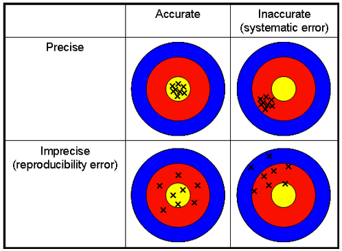
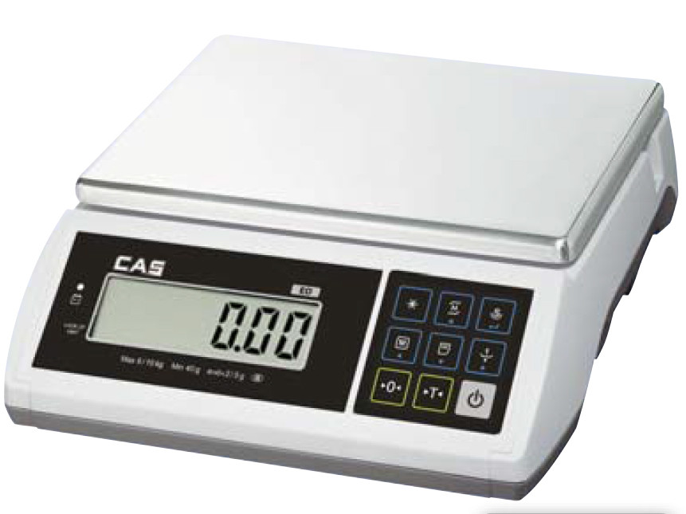

```{r setup, include=FALSE}
library(learnr)
library(mosaic)
library(ggside)
set.seed(123)
caterpillers <- read.csv("www/regression.csv")
crop_growth <- read.csv("www/crop_growth.csv")
knitr::opts_chunk$set(echo = FALSE)
```


## Why do we measure variation?

### Introduction
Simply measuring the mean of a set of data does not give you any indication about
the **spread** of values in the data. There are a number of ways in which varibility
in the measurements can be calculated, and sometimes used to determine whether your
explanatory variables are affecting your response variables. We will focus on
several measures in this tutorial:

* sample mean
* sums of squares
* variance
* standard deviation
* standard error
* 95% confidence intervals

### Why do I need to know this?
You can drive a car without having to know exactly what a differential is doing,
what a carburettor is for, or why the engine has a crankshaft. However, if you
have a basic understanding of its mechanics you'll find it easier to diagnose
faults _What is causing that squeaking from the rear axle?_, and avoid expensive
errors _Is it OK to put diesel in a petrol engine?_


The same applies to you as a quantitative biologist. You can't treat your models
as a mysterious black box into which you chuck data and some magic numbers are
returned. You need a basic understanding of how the models work and why, and this
will help you diagnose if anything goes wrong.

Don't worry, we'll keep the mathematics to a minimum, and use graphical and
interactive components where possible.
  

## Measures of central tendency

### What is 'central tendency'?
We are so familiar with some concepts, such as averages, that it is easy to
forget the biases implicit how they are calculated. For example,
if you listen to any politicians speaking, they will always talk about "the average
salary" that people are earning. The mean is not, however, the measure used by the
_Office for National Statistics_ (ONS) who actually collect the data. The latter
always prefer to use the "median salary". There is actually a big difference
between the two (about £5000 per year on current figures). The median salary is
what most people earn. The average salary is "distorted" by a relatively small
number of people earning incredibly high salaries (heads of FTSE100 companies 
etc.) and so doesn't represent what most people earn. We need to understand the
difference between how a mean and a median are calculated and what their values
represent.

### Mean
This is the most commonly use measure of central tendency, i.e. take the sum of
all the values, and divide by the number of values. So that you are familiar with
algebraic notation, let's include the formula for a mean here, even though you
know how to calculate it:

$$\overline{x} = \frac{1}{n}\sum_{i = 1}^{n}x_i$$
Ehh?? How can calculating something as simple as an average look so horrific!!
Bear with me, because once you understand this equation, all the others fall
neatly into place.

* $\overline{x}$ = this is the mean, usually represented with a horizontal line above the symbol
* $n$ = the number of items of data
* $i$ = a counter. If you had five items of data ($n=5$), your counter $i$ will be 1, 2, 3, 4, 5
* $x_i$ = the value for each data point. So if you had five items of data, 6, 2, 1, 0, 8 
these would be $x_1 = 6$, $x_2 = 2$, $x_3 = 1$, $x_4 = 0$ and $x_5 = 8$
* $\sum$ = the Greek letter _sigma_ to indicate take the sum of a set of values
The subscript $i=1$ and superscript $n$ indicate to calculate the sum from your
first value where $i=1$ (the number 6 here) through every value up to your $n^{th}$
value (the fifth number, 8 in this example). Here $n = 5$ 
* $\frac{1}{n}$ = the reciprocal of $n$. Multiplying by the reciprocal of $n$ is
the same as dividing by $n$

To calculate a mean in R use the `mean()` function. If you want the mean broken
down by different categories of an explanatory variable, you can use the
syntax:

`mean(responsevar ~ categorical_explanatory, data=datasetname)`


### Median
The median is the value where 50% of your dataset is above the median, and
50% is below the median. It can be calculated using the `median()` function in R
with a similar syntax to above. If your data are normally distributed (bell-shaped
curve) the mean and median will be fairly similar as shown by the vertical lines. I've 
also put a boxplot at the top of the graphs to help your interpretation:

```{r similar_mean_median}
# generate 500 values at random with mean of 58
set.seed(123)
normal_distribution <- rnorm(500, mean=58)
mean_normal_distribution <- mean(~normal_distribution) * 1.0001
median_normal_distribution <- median(~normal_distribution)
sumstats <- data.frame(Statistic = c("Mean", "Median"),
                       value = c(mean_normal_distribution, median_normal_distribution))
ggplot(data.frame(normal_distribution), aes(x = normal_distribution)) +
  geom_histogram(bins = 30) +
  geom_vline(data = sumstats, aes(xintercept = value, col = Statistic)) +
  geom_xsideboxplot(data = data.frame(normal_distribution), orientation = "y") +
  theme_classic()
#gf_histogram(~ normal_distribution)
```

Mean = `r round(mean(normal_distribution), 2)`
Median = `r round(median(normal_distribution), 2)`

However, if the data are skewed, then the mean and median drift apart:

```{r dissimilar_mean_median}
# generate 500 values from a non-normal distribution
# set.seed(123)
non_normal_distribution <- rlnorm(500, meanlog=log(58))
mean_non_normal_distribution <- mean(~non_normal_distribution)
median_non_normal_distribution <- median(~non_normal_distribution)
sumstats <- data.frame(Statistic = c("Mean", "Median"),
                       value = c(mean_non_normal_distribution, median_non_normal_distribution))
ggplot(data.frame(non_normal_distribution), aes(x = non_normal_distribution)) +
  geom_histogram(bins = 30) +
  geom_vline(data = sumstats, aes(xintercept = value, col = Statistic)) +
  geom_xsideboxplot(data = data.frame(non_normal_distribution), orientation = "y") +
  theme_classic()
```

Mean = `r round(mean(non_normal_distribution), 2)`
Median = `r round(median(non_normal_distribution), 2)`

Notice how in the skewed distribution, the median value gives a much more
representative indication of the 'central tendancy' than the mean, which was
distorted by a few very high values. The differences are also obvious in the two
boxplots. In the normal distribution the boxplot is symmetrical, whereas in the
non-normal distribution it is skewed, with most of the data being less than the
mean.

## Sensitivity to outliers
An **outlier** data point is a very extreme value. These can arise if you have
mis-read a measuring device in the field or laboratory. A common source of outlier
values is if you are typing in data from a notebook into a spreadsheet, and you
make a typo, for example entering **103** when you meant to enter **10.3**. How
important are these outliers? Use the interactive below to adjust the number of
observations you have collected, and the size of your outlier value. The mean
value is shown in black, and the median a red horizontal line. Then answer the
questions after the interactive.

```{r, echo=FALSE}
# Define UI for application that draws a histogram
fluidPage(
    titlePanel("Stability of Mean & Median"),
    sidebarPanel(
        sliderInput("outlier", "Value of outlier", 60, 90, 60, step = 1 ),
        sliderInput("number", "Number of sample points", 3, 30, 10, step = 1 ),
   ),
    mainPanel(
        fluidRow(
            column(6,
                   wellPanel(
                       h3("Without outlier"),
                       plotOutput("plot1"),
                         h4("mean"),
                       textOutput("mean1"),
                       h4("median"),
                       textOutput("median1"))),
            column(6,
                   wellPanel(
                       h3("With outlier"),
                       plotOutput("plot2"),
                       fluidRow(
                           column(6,
                                  h4("mean"),
                                  div(id="mean",
                                  textOutput("mean2"))),
                           column(6,
                                  h4("Change in mean with outlier"),
                                  div(id="deviation",
                                  textOutput("deviation")))
                       ),
                       fluidRow(
                           column(6,
                                  h4("median"),
                                  div(id="median",
                                  textOutput("median2"))),
                           column(6,
                                  h4("Change in median with outlier"),
                                  div(id="deviation2",
                                  textOutput("deviation2")))
                       )
                   )
            )
        )
    )
)

```

```{r, context="server"}
    data <- data.frame(x = 1:100, y = rnorm(100,50,3))
    # define fixed yrange for plot
    yrange <- range(c(data$y, 90))
    # format value
    styler <- function(value) {
        sprintf("%.2f", value)
    }
        
        # observe changes to number of trials and return subset of data
        reactiveCalc <- reactive({
            number     <- input$number
            outlier.y <- input$outlier
            isolate({
                if (is.null(number) || is.null(outlier.y)) {
                    return(NULL)
                }
                
                # get subset of sample points
                df  <- subset(data, x <= number)
                m   <- mean(df$y)
                mdn <- median(df$y)
                
                # include outlier to special data.frame and compute descriptive statistics
                outlier.x   <- nrow(df) + 1
                df.outlier  <- data.frame(x=c(df$x, outlier.x), y=c(df$y, outlier.y)) 
                m.outlier   <- mean(df.outlier$y)
                mdn.outlier <- median(df.outlier$y)
                col.outlier <- "red"
                
                # compute deviations
                m.delta   <- abs(m.outlier   - m)
                mdn.delta <- abs(mdn.outlier - mdn)
                
                return(list(df=df, m=m, mdn=mdn, outlier.x=outlier.x, outlier.y=outlier.y,
                            df.outlier=df.outlier, m.outlier=m.outlier, mdn.outlier=mdn.outlier,
                            m.delta = m.delta, mdn.delta = mdn.delta,
                            col.outlier = col.outlier))
            })
        })
        
        calcMean <- function(includeoutlier) {
            df <- reactiveDf()
            if (is.null(df)) return()
            if (includeoutlier) {
                mean(c(df$y,input$outlier))
            } else {
                mean(df$y)
            }
        }
        
        calcMedian <- function(includeoutlier) {
            df <- reactiveDf()
            if (is.null(df)) return()
            if (includeoutlier) {
                median(c(df$y,input$outlier))
            } else {
                median(df$y)
            }
        }
        
        deviation <- function() {
            df <- reactiveDf()
            if (is.null(df)) return()
            d <- abs(mean(c(df$y,input$outlier)) - mean(df$y))
            sprintf("+%.02f",d)
        }
        
        deviation2 <- function() {
            df <- reactiveDf()
            if (is.null(df)) return()
            d <- abs(median(c(df$y,input$outlier)) - median(df$y))
            sprintf("+%.02f",d)
        }

        output$plot1     <- renderPlot({
            val <- reactiveCalc()
            df <- val$df
            meanval <- val$m
            medval  <- val$mdn
            p <- ggplot(df, aes(x=x, y=y)) +
                geom_point() +
                geom_hline(yintercept = meanval) +
                geom_hline(yintercept = medval, linetype = "dashed", colour = "red") +
                ylim(c(40, 90)) +
                theme_classic()
            return(p)
        })
        
        output$plot2     <- renderPlot({
            val <- reactiveCalc()
            df <- val$df.outlier
            meanval <- val$m.outlier
            medval  <- val$mdn.outlier
            p <- ggplot(df, aes(x=x, y=y)) +
                geom_point() +
                geom_hline(yintercept = meanval) +
                geom_hline(yintercept = medval, linetype = "dashed", colour = "red") +
                ylim(c(40, 90)) +
                theme_classic()
            return(p)
        })
        
        output$mean1     <- renderText({ val <- reactiveCalc(); if(!is.null(val)) styler(val$m) })
        output$mean2     <- renderText({ val <- reactiveCalc(); if(!is.null(val)) styler(val$m.outlier) })
        output$median1   <- renderText({ val <- reactiveCalc(); if(!is.null(val)) styler(val$mdn) })
        output$median2   <- renderText({ val <- reactiveCalc(); if(!is.null(val)) styler(val$mdn.outlier) })
        output$deviation <- renderText({ val <- reactiveCalc(); if(!is.null(val)) styler(val$m.delta) })
        output$deviation2<- renderText({ val <- reactiveCalc(); if(!is.null(val)) styler(val$mdn.delta) })

```

Thinking about what happened as you changed the size of the outlier and the
number of observations:

```{r outlier_questions}
question("Which of these is true?",
         answer("The mean is more robust to outliers than the median"),
         answer("The median is more robust to outliers", correct = TRUE),
         answer("The effect of outliers is less when there are lots of observations", correct = TRUE),
         answer("The effects of outliers is less when there are few observations"),
         allow_retry = TRUE,
         random_answer_order = TRUE)
```


## Variability around the mean
Lets look at a set of data and think about how you might measure the variability
around the mean. Remember that in practice you often don't know what is causing
this variability in your data, but you still want to quantify it. Suppose you 
have the following 12 numbers from an experiment. This could all be from the
same treatment for example:

* 22.04, 26.28, 18.82, 20.51, 21.17, 19.26, 23.68, 22.17, 23.31, 24.21, 19.45, 25.13

You can easily store these in an R object called `x` using the `c()` function
which _concatenates_ them all into a single object. Remember that just typing
the name of an R object will return its contents. Calculate the mean, median,
minumum and maximum values, and display a frequency histogram using the
`gf_histogram()` function:

```{r twelve_numbers, exercise = TRUE, code.completion = FALSE}
x <- c(22.04, 26.28, 18.82, 20.51, 21.17, 19.26, 23.68, 22.17, 23.31, 24.21, 19.45, 25.13)

```
```{r twelve_numbers-solution}
x # Display the contents of R object
mean(x)
median(x)
min(x)
max(x)
gf_histogram( ~ x)
```

You can see that the mean value is 22.17, so what is the best
way of measuring the variability around this mean? Before answering that
question, it is helpful to plot the data, from the first observation to twelveth
observation (numbers 1 to 12) along the x-axis, with the actual values for each
observation on the y-axis. We use a dotted horizontal line to show the overall
mean, and vertical lines above and below this to show how each observation 
varies.

```{r twelve_mean_and_deviations}
x <- c(22.04, 26.28, 18.82, 20.51, 21.17, 19.26, 23.68, 22.17, 23.31, 24.21, 19.45, 25.13)
tmp <- data.frame(cbind(xobsno=1:12, xobsval=x))
ggplot(aes(x=xobsno, y=xobsval), data=tmp) +
  geom_point() +
  geom_hline(yintercept = mean(tmp$xobsval), linetype = "dashed") +
  geom_segment(aes(x=xobsno, y=xobsval), xend = tmp$xobsno, yend = mean(tmp$xobsval)) +
  scale_x_continuous(breaks = 1:12) +
  xlab("Observation number from 1 to 12") +
  ylab("Recorded value for each observation") +
  theme_classic()
```

You can see that the 1st and 8th observations are very close to the overall
mean, whereas the 2nd, 6th, 11th and 12th observations are quite far from the
overall mean. Looking at this graph, think about the following question:

```{r how_to_measure_variation}
question("What do you think is the best way to measure the variability around this mean?",
         answer("Total of square roots of differences between mean and observed values",
                message = "Some of your differences are negative, and you cannot take
                the square root of a negative number"),
         answer("Total of differences between mean and observed values", message = "The
                differences from the mean are positive and negative. If you add up
                all these values you will obtain the answer zero"),
         answer("Total of squares of differences between mean and observed values",
                message = "Good. By squaring the differences before adding them
                together you remove the negative values (e.g. -3 x -3 = +9)", correct = TRUE),
         allow_retry = TRUE,
         random_answer_order = TRUE)
```


## The SS
The sum of squares, shortened to SS, is the simplest possible measure of variation around the mean. Whilst it has several limitations, as will be explained on later pages of this website, all the more advanced measures use SS as their basic foundation. First you calculate the difference of each observation from the mean of all the observations, then you square those differences (i.e. multiply the difference with itself) then add them together (the sum). This gives you the SS, a simple 
measure of the variability in your data. We can represent this algebraically as:

$$SS = \sum_{i = 1}^{n}(\overline{x}-x_i)^2$$
where

* $SS$ = sum of squares
* $\overline{x}$ = mean of your set of values, 22.17 on previous screen.
* $x_i$ = the value for each data point. We have 12 data points, $x_1 = 22.04$,
$x_2 = 26.28$, $x_3 = 18.82$, ..., $x_{12} = 25.13$
* $\sum$ =  Greek letter _sigma_ to indicate take the sum the squared differences

Note that the $\overline{x}-x_i$ part of the equation is inside brackets, before
squaring the results $(\overline{x}-x_i)^2$. This ensures that the difference is
calculated first, and then it is squared. If it had been written $\overline{x}-x_i^2$
you would obtain the wrong answer, as the observation value would have been squared
first, before being subtracted from the mean.

You can easily calculate the SS for a set of numbers in R. It is very unlikely
that you will ever have to do this, but some of your analysis outputs may include
a column headed 'SS' so it is useful to know what is going on. Using the twelve
numbers we had earlier, have a go at calculating the SS. There are 4 hints to
help you, the final one containing the solution, but try to have a go at working
it out yourself:

```{r calc_SS, exercise = TRUE, code.completion = FALSE}
x <- c(22.04, 26.28, 18.82, 20.51, 21.17, 19.26, 23.68, 22.17, 23.31, 24.21, 19.45, 25.13)

```

```{r calc_SS-hint-1}
# Subtract each observation from the mean
mean(x) - x
```

```{r calc_SS-hint-2}
# Remember to add brackets before squaring the differences
(mean(x) - x)
```

```{r calc_SS-hint-3}
# Use the ^2 to square the differences
(mean(x) - x)^2
```

```{r calc_SS-hint-4}
# Finally use the sum() function, requiring a second set of brackets
sum((mean(x) - x)^2)
```

## Problems with SS
Although SS is used in analyses, it is still not good enough to present in for
example a summary of your results. There are two  problems. The first relates
to the number of observations (e.g. replicates), and the second the units of
measurement.

Look at the following two graphs. The one on the left gives the data with 12
observations that you have already studied. The one on the right gives a larger
set of data with 30 observations.  Two key points are obvious:

* The means are similar for both sets of data
* There is less variability around the mean for the dataset on the right

```{r twelve_and_thirty_mean_and_deviations, warning = FALSE}
# Multiple plot function
#
# ggplot objects can be passed in ..., or to plotlist (as a list of ggplot objects)
# - cols:   Number of columns in layout
# - layout: A matrix specifying the layout. If present, 'cols' is ignored.
#
# If the layout is something like matrix(c(1,2,3,3), nrow=2, byrow=TRUE),
# then plot 1 will go in the upper left, 2 will go in the upper right, and
# 3 will go all the way across the bottom.
#
multiplot <- function(..., plotlist=NULL, file, cols=1, layout=NULL) {
  library(grid)

  # Make a list from the ... arguments and plotlist
  plots <- c(list(...), plotlist)

  numPlots = length(plots)

  # If layout is NULL, then use 'cols' to determine layout
  if (is.null(layout)) {
    # Make the panel
    # ncol: Number of columns of plots
    # nrow: Number of rows needed, calculated from # of cols
    layout <- matrix(seq(1, cols * ceiling(numPlots/cols)),
                    ncol = cols, nrow = ceiling(numPlots/cols))
  }

 if (numPlots==1) {
    print(plots[[1]])

  } else {
    # Set up the page
    grid.newpage()
    pushViewport(viewport(layout = grid.layout(nrow(layout), ncol(layout))))

    # Make each plot, in the correct location
    for (i in 1:numPlots) {
      # Get the i,j matrix positions of the regions that contain this subplot
      matchidx <- as.data.frame(which(layout == i, arr.ind = TRUE))

      print(plots[[i]], vp = viewport(layout.pos.row = matchidx$row,
                                      layout.pos.col = matchidx$col))
    }
  }
}


x1 <- c(22.04, 26.28, 18.82, 20.51, 21.17, 19.26, 23.68, 22.17, 23.31, 24.21, 19.45, 25.13)
x2 <- c(27.11, 20.83, 21.17, 19.82, 22.47, 22.54, 23.62, 22.31, 22.92, 23.55, 20.26, 23.53,
        21.91, 23.51, 24.56, 21.57, 23.71, 23.57, 21.73, 20.21, 21.59, 22.47, 22.04, 21.27,
        19.70, 24.10, 19.92, 20.19, 23.56, 21.06)
x1_df <- data.frame(cbind(x1obsno=1:12, x1obsval=x1))
x2_df <- data.frame(cbind(x2obsno=1:30, x2obsval=x2))
p1 <- ggplot(aes(x=x1obsno, y=x1obsval), data=x1_df) +
  geom_point() +
  geom_hline(yintercept = mean(x1_df$x1obsval), linetype = "dashed") +
  geom_segment(aes(x=x1obsno, y=x1obsval), xend = x1_df$x1obsno, yend = mean(x1_df$x1obsval)) +
  scale_x_continuous(breaks = 1:12) +
  scale_y_continuous(limits = c(18, 27), breaks = 18:27) +
  xlab("Observation number from 1 to 12") +
  ylab("Recorded value for each observation") +
  theme_classic()
p2 <- ggplot(aes(x=x2obsno, y=x2obsval), data=x2_df) +
  geom_point() +
  geom_hline(yintercept = mean(x2_df$x2obsval), linetype = "dashed") +
  geom_segment(aes(x=x2obsno, y=x2obsval), xend = x2_df$x2obsno, yend = mean(x2_df$x2obsval)) +
  scale_x_continuous(breaks = 1:30) +
  scale_y_continuous(limits = c(18, 27), breaks = 18:27) +
  xlab("Observation number from 1 to 30") +
  ylab("Recorded value for each observation") +
  theme_classic()

multiplot(p1, p2, cols = 2)
```

Now go ahead and check the means, medians, minimum, maximum and SS for the two 
datasets, and see how they compare. We'll call your original dataset of 12 values
`x1`, and the larger dataset of 30 values `x2`:

```{r compare_two_SS, exercise = TRUE, code.completion = FALSE, exercise.lines = 16}
x1 <- c(22.04, 26.28, 18.82, 20.51, 21.17, 19.26, 23.68, 22.17, 23.31, 24.21, 19.45, 25.13)
x2 <- c(25.11, 20.83, 21.17, 19.82, 22.47, 22.54, 23.62, 22.31, 22.92, 23.55, 20.26, 23.53,
        21.91, 23.51, 24.56, 21.57, 23.71, 23.57, 21.73, 20.21, 21.59, 22.47, 22.04, 21.27,
        19.70, 24.10, 19.92, 20.19, 23.56, 21.06)

# Now we calculate the mean, median, minimum and maximum, and SS of your data
mean(x1)
mean(x2)
median(x1)
median(x2)
min(x1)
max(x1)
min(x2)
max(x2)
sum((mean(x1) - x1)^2)
sum((mean(x2) - x2)^2)
```

There is obviously a problem using SS to measure variability. The SS is `r round(sum((mean(x1) - x1)^2), digits = 2)` for
the dataset with 12 values, but 66.80 for the dataset with 30 values. Even
though the dataset with 30 values has **less variability**, when judged by simple
visual assessment or maximum and minimum values, the **SS is actually larger** for
the bigger dataset.  Why do you think this problem has arisen?

```{r why_is_SS_not_sufficient}
question("Why do you think SS was bigger with 30 than 12 observations?",
         answer("There really is more noise and variability around the mean in the 30
                observation dataset", message = "No, there is less variation on
                average. The problem is that we measured the total variation,
                rather than taking an average of the variation"),
         answer("We need to correct the SS for the number of observations", correct = 
                TRUE, message = "Good. We need to divide the SS by a variable
                indicative of the number of observations, to obtain the mean SS"),
         answer("SS involes taking a square of the data. This distorts the result",
                message = "No, squaring the differences is not the problem here,
                although you are right that we will need to adjust for it at
                some stage. Here the problem is that we need to take an average
                of the SS, correcting for the number of observations"),
         allow_retry = TRUE,
         random_answer_order = TRUE)
```


## Variance: correcting SS for the number of records

Our problem with using SS to try and quantify the 'spread' or 'variability' in
your data is that as the size of your dataset gets bigger, the SS gets bigger.
So even though your dataset with 30 records was less noisy than the one with 12
observations, by simply taking the total of the squared differences from the 
mean, we over-estimated the variation in the 30 observation dataset.

We need some way of calculating a value that measures 'average' or
'mean' sum of squares. This value was originally known as the **mean sum of squares**
or **mean square** and you will sometimes see the letters **MS** in the outputs
from a linear model or other analysis. However, it is more commonly known as
the **variance** and often written with the Greek letter sigma-squared $\sigma^2$
or as $s^2$.

### How should you calculate the variance?
The most obvious answer is simply to divide your SS by $n$ the number of
observations in your dataset. However, at this point you hit a minor, but quite
subtle problem. To calculate your SS, in the first step you took each observation
and subtracted it from $\overline{x}$ the overall mean. Once you start making
calculations based on other parameters that you have already estimated, in this
case a mean based on a **sample** of the real whole 'population' of possible
datasets that might have been collected, you start to limit what you can do.

This is easiest to explain with a trivial example. Imagine you have 5 observations,
the mean is 30.0, and the first four observations are:

* 24 , 48, 41, 18

what is the value of the fifth observation? You actually have **no choice** in
what the fifth observation can be. It has to be **19** in order for the average
to be 30.0. In other words, if you have 5 data points to calculate your (known)
mean, you have complete freedom as to what any four of those data points are,
but no choice as to the final one. The same issue applies irrespective of how
many observations are used to calculate your mean. For the 12 observation 
dataset, if you have **already calculated the mean** there is complete flexibility
on the values of 11 observations, but not the twelth. Similarly for the 30
observation dataset. So here we have flexibility of choice on $n - 1$ observations.
This concept is known as **degrees of freedom** (df).

### Key points 

* In general the number of degrees of freedom will be $n$ minus the number of parameters being estimated.
* To correct the sums of squares (SS) for the number of observations, we divide by $n - 1$ rather than $n$ where $n$ is the number of observations, as we have calculated one parameter (the mean) already.


## Calculating the variance (SS corrected for number of observations)
Hopefully it is now clear to you that as we have already calculated a mean
$\overline{x}$ we need to correct our SS by dividing by $n - 1$ rather than $n$.
So the actual formula for variance, often shown as $\sigma^2$ or $s^2$ is:

$$variance = s^2 = \sigma^2 = \frac{Sum\textrm{ }of\textrm{ }Squares}{degrees\textrm{ }of\textrm{ }freedom}$$
which is the same as multiplying the SS by the reciprocal of the degrees of
freedom (look back at the equation on how to calculate a mean):

$$variance = s^2 = \sigma^2 = \frac{1}{n - 1}\sum_{i = 1}^{n}(\overline{x}-x_i)^2$$
Variance can be calcuated in R using the `var()` function. If you want the 
variance for just one column of a dataset, use the syntax:

`var( ~ variable_name, data=dataset_name)` or
`var( variable_name ~ NULL, data=dataset_name)` 

If you want to calculate it separately for each level of a **categorical**
explanatory variable, you can use the syntax

`var(response_variable ~ explanatory_variable, data=dataset_name)`

### Two example datasets
Here we will use two datasets, that you will have a chance to explore further in the practical classes. On these webpages they can be accessed as the `caterpillers` and `crop_growth` data.frames.

#### Caterpillers dataset
Many plants produce tannins as a defence chemical to reduce insect attack. It is what gives black tea its slightly bitter taste. This dataset is from an experiment to investigate the rate of insect growth (mg/day) as a result of the amount of tannins in the diet (mg). Both variables `growth` and `tannin` are continuous numeric. Here the `growth` is your "response" variable and the `tannin` your "explanatory" variable (think about cause and effect).

#### Crop growth dataset
Soil type has a major effect on the growth of many agricultural crops. These data are from a simple agricultural experiment to compare the yield of winter wheat, stored in the `growth` on three soil types, stored in the `soil` column. Here `growth` is a continuous numeric response variable, and `soil` is a categorical explanatory "factor" with three "levels" in it: `sand`, `clay` and `loam`.

Have a go at calculating the variance for some of your data from the `caterpillers`
and `crop_growth` datasets. Edit the following code to make it work, or click on the "Solution" button if you get stuck:

```{r calc_variance, exercise = TRUE, code.completion = FALSE, exercise.lines = 11}
# Overall variance for each column of caterpillers
# Hint: you only need to enter one column name on the next two lines as you
# are calculating the overall variance
var( ~ , data=caterpillers)
var( ~ , data=caterpillers)
# Overall variance for crop yield
# Hint: again only one variable name needed
var( ~ , data = crop_growth)
# Variance for each soil type
# Hint: two variable names needed, one each side of ~ symbol
var( ~ , data = crop_growth)

```
```{r calc_variance-solution}
# Overall variance for each column of caterpillers
var(~ tannin, data=caterpillers)
var(~ growth, data=caterpillers)
# Overall variance for crop yield
var( ~ yield, data = crop_growth)
# Variance for each soil type
var(yield ~ soil, data = crop_growth)
```

You will see variances displayed in the outputs of many linear models, often shown as **_MS_** for "mean sums of square",
to test the importance of predictors.

However, there is still a problem with using variance as a general way to 
describe the spread of your data. Can you see what it might be.

```{r what_is_wrong_with_variance}
question("What is the main problem in using variance to describe the spread of data around the mean?",
         answer("It does not take into account the full range of data values",
                message = "No, it uses all your data observations"),
         answer("It is not as accurate as just using the maximum and minimum values",
                message = "No, it is a better measure than the maximum and minimum values"),
         answer("It does not have sensible units of measurement",
                message = "Good. In the calculation of SS you squared the original
                units. So if your original units were kg, they are now kg-squared.
                These units are probably not biologically sensible", correct = TRUE),
         allow_retry = TRUE,
         random_answer_order = TRUE)
```

## Standard deviation: correct units
Whilst variance is useful, the main problem is that as a result of squaring all
the original deviations above and below the mean to calculate the sums of squares
the units of variance are themselves squared. So, you have now gone from $g$ to
$g^2$ or $\mu g$ to $\mu g^2$ which probably does not make any sense. The
correction you need to apply is simply to take the square root of the variance,
to calculate the **standard deviation**. This if often to $sd$, $s$ or $\sigma$

$$sd = s = \sigma = \sqrt{s^2} = \sqrt{\sigma^2} = \sqrt{\frac{1}{n - 1}\sum_{i = 1}^{n}(\overline{x}-x_i)^2}$$

This equation may look a little fierce, but hopefully you can see how we have
simply taken the square root of our equation for variance. Recall from earlier
that variance is often written as $s^2$ or $\sigma^2$ 

**Phew - problem of measuring the spread now solved?** Not so fast. There is still
a quite subtle problem that we need to address, which comes down to **how**
**reproducible is your research?** If another scientist were to repeat your
experiment, how likely are they to reach the same conclusions as you did? This
depends to a large extent on the **accuracy** and **precision** of your measurements.

## Accuracy and precision
You will sometimes see the terms accuracy and precision referred to as **bias** 
and **variance**. Whilst standard deviation (SD) gives you an insight into the
"spread" of your data, this measurement is going to be influenced by the number
of samples you take, and we use a minor adjustment to SD to calculate the 
standard error (SE) to account for this.

First, let's get a better understanding of what we mean by accuracy and precision.
Imagine you are playing with bows and arrows, or on a dartboard.
Ideally you want every one of your shots to hit exactly on target.


Imagine that the "bulls-eye" on the dartboard is the "real" value that you want
to measure, for example:

* tree diameter at breast height
* actual length of DNA sequence
* the bird diversity in a woodland

Of course, no matter how hard you try, there will be variation, for example:

* when measuring tree diameter at breast height you don't always hold the tape 
measure exactly horizontal
* when using your MinION sequencer, some DNA reads are not returned at random
* you don't manage to see every species of bird on your visit to the woodland

Some of your darts might even miss the dart board altogether, which is rather
like having missing data. This could lead you to have more observations for some
treatments than others. How do we take this into account? Using the dart board
analogy, we can think of four possible extremes:



So ideally we'd like all our observations in the top left, i.e. on target and
with very little spread around the average value. We certainly want to avoid
inaccurate measurements - systematic errors might occur if, to take our examples
from above:

* your tape measure had stretched so you always underestimated tree diameter at
breast height
* your MinION device was contaminated, so additional DNA reads occurred in
every sample
* you did not know how to distinguish between great tits and blue tits, so
always mis-counted the number of bird species in your woodland.

Looking at the two dartboards in the left column above, they are both accurate,
in that their means are approximately on their true value. However, one at the
bottom left is very imprecise.

### False measures of precision
It is very easy to mislead your reader into how precisely you have measured
your data. Look closely at the following picture of an inexpensive laboratory
balance. You are going to use it to weigh some soil samples, and calculate
the mean soil sample weight. Calculate the mean sample weight, and answer
the question below. There are six samples, and the data are below.



```{r mean_soil, exercise = TRUE, code.completion = FALSE}
soil_samples <- c(3.51, 3.82, 3.12, 3.97, 2.97, 3.66)

```

```{r what_soil_mean}
question("What the mean soil weight?",
         answer("3.508333",
                message = "No, the balance is only to 2 decimal places"),
         answer("3.5",
                message = "No, the value 3.508 should be rounded to nearest
                2 decimal places 3.51, as the balance is only accurate to 2 decimals"),
         answer("3.51",
                message = "Good. The balance is only accurate to 2 decimal places
                and you round up the 3rd decimal if it is 5 or above (8 here).", 
                correct = TRUE),
         answer("3.50",
                message = "Round up to the nearest appropriate decimal. You are
                right that it should be 2 decimal places, but if the 3rd decimal
                is 5 or above (8 here) round up."),
         allow_retry = TRUE,
         random_answer_order = TRUE)
```

Next, we are going to show how you can take account of the number of samples to
get a measurement of precision.

## How to measure accuracy and precision
You have already used standard deviation ($\sigma$), and the other closely 
related variable is standard error (se or SE). SE is generally preferred when
you present summary statistics in graphs or tables as it corrects for sample size.
SEs can be calculated as:

$$se = \frac{\sigma}{\sqrt{n}}$$

Obviously, standard error is smaller than standard deviation, as you divide by
the square root of $n$, but they relate to our dartboard example earlier in that
standard error provides a measure of the **precision** of you measurement, or
how much spread there is in the darts you threw at the dartboard.

Both SD and SE get smaller with increasing sample size $n$.

You might be wondering how you measure the **accuracy** of your data. Actually 
this is more challenging: if doing a laboratory study, you might have a reference
sample against which you can calibrate your data. For field-based studies it is
more difficult, but cross-referencing with previously published data from similar
environments can help.

### How to calculate standard error in R
Oddly enough, there isn't a built-in function to calculate SE, presumably
because the calculation is fairly trivial. In the exercise below, first calculate
the standard deviation, and then the standard error, for the numbers in `x`, as
well as the mean. There are 7 numbers, but see if you can calculate the se 
without actually putting `7` into your code.

```{r calc_se, exercise = TRUE, code.completion = FALSE}
x <- c(4.521, 2.832, 9.185, 7.324, 5.461, 6.108, 8.911)

```
```{r calc_se-solution}
# Overall variance for each column of caterpillers
# Mean
mean(x)
# Standard deviation
sd(x)
# Standard error. Use length() to work out number of items of data that you
# might be working with. You can also use tally() or nrow() if you have tables
# (data.frames) of data.
sd(x)/sqrt(length(x))
```

### How to describe SE in your reports

What you have just calculated is actually a standard error of the mean (SEM), i.e. a **measure of the precision of your sample mean**. The larger the value of $n$, the better the precision. You can calculate SE for differences between variables, slopes, intercepts 
etc. and you will often see them displayed in outputs from analyses. When
writing reports, people sometimes use standard deviations, and sometimes
standard errors, although in general it is better to use SE. Write it in this
sort of way:
  
* The treatment had a mean weight of 6.335 $\pm$ 0.874 SE.
  
This makes it clear that you are talking about SE, and not SD, and the $\pm$
symbol indicates variation above $+$ or below $-$ the mean.

### An aside in case you are curious
Hopefully you understand that SE simply takes account of the number of 
observations in your sample. Bigger samples are likely to be more precise,
so we divided by $\sqrt{n}$
  
However, you might be wondering, "Why divide by $\sqrt{n}$ rather than by $n$?"
The reason is quite subtle, but in essence, as you increase your sample size
the change in the estimated standard error (y-axis) if plotted against sample
size $n$ (x-axis) forms a curve. This can be changed to a straight line if $n^{0.5}$
You might recall from school maths classes that when you raise something to
the power of 0.5, it is the same as taking the square root. There is a nice
simple worked example of this [here](https://www.drdawnwright.com/why-divide-by-the-square-root-of-n/)

## Confidence intervals
The final type of measure of variation we will discuss are 95% Confidence
Intervals, often abbreviated to 95% CI. Imagine you do a laboratory experiment
or field survey, collect some data, and calculate a mean value. If you repeated
the same experiment or field survey later the same data, how confident would
you be that you'd get roughly the same mean value? Of course, you'll never
obtain exactly the same value, due to natural unexplained "noise" in your data.
But if you were able to obtain the similar results 19 times out of 20 (95%) then
you could be reasonably confident about your results.

Confidence intervals are based on ideas from data from a normal or
bell-shaped distribution (also known as a Gaussian distribution). Here, roughly
95% of the data points occur within plus or minus about 2 standard deviations
from the mean:

```{r norm_dist_with_95}
gf_dist("norm", params = list(mean=0), fill = ~ (abs(x) <= 1.96), geom = "area") %>%
  gf_labs(x="Value of variable; mean is zero, SD is 1.0", y="Proportion")
```

You can see that about 95% of the values are in the shaded area of this
random normal distribution. It is actually mean +/- 1.96 of the standard
deviation, although think of it as 2.0 if that is easier to remember.

One advantage of 95% CI is that they can be displayed in a graph, and provide
a more nuanced interpretation of your data than a simple "significant" or
"non-significant" approach. 

Use the `confint()` function to calculate 95% CI. In the following R code box, a
dataset of 40 replicates from a laboratory experiment has recorded, stored in
the variable `my_data`. Calculate both the mean and 95% CI of this dataset. Use 
the solution button if you get stuck:

```{r prepare-show95CI}
# Generate some random data
set.seed(123)
my_data <- rnorm(n=40, mean=50, sd=1)
```

```{r show_95CI, exercise=TRUE, exercise.setup = "prepare-show95CI", exercise.lines=7}
# Hint: as you only have a single column of numbers in my_data you do not need
# the ~ or data= components to your calls to mean() or confint()
```

```{r show_95CI-solution}
# Display mean
mean(my_data)

# Display 95% around the mean
confint(my_data)

```

$100 - 95 = 5$ and $5$  is split into two, for upper and lower values, that is
$5 \div 2 = 2.5$, thus the results of the `confint()` function are displayed in
columns 2.5% and 97.5%. This represents the blue area in the graph at the top of
the page. 

You should have a mean of 50.045, a lower 95% CI of 48.306 and an upper 95% CI
of 51.717. You should interpret this as saying that if you were to repeat your
laboratory experiment 20 times then 19 times out of 20 the mean value would be
between 48.306 and 51.717. Don't misinterpret this statistic: it does **not**
indicate that you are 95% confident your mean value is between 48.306 and 51.717.

## Summary
From this website you should now have a good grasp of:

+ Measures of central tendency, especially mean and median
+ Measures variability around the mean, especially variance, standard deviation,
standard error and 95% confidence intervals

Whilst some of the equations to calculate the variability around a mean may
appear daunting at first sight, hopefully by building up from the simple sum of
squares in a sequential manner you can see how they are related to each other.
You will see all these terms, especially mean, variance and SE, in the outputs
of many of your data analyses.


### Further reading
+ [The Statistics with R: an introduction for Biologists (2nd Edition)](https://doi-org.libproxy.ncl.ac.uk/10.1093/oso/9780198798170.003.0005) 
gives a clear explanation of standard errors, confidence intervals etc. in
Chapter 5 "Estimation". It uses biological examples, although does not use the
`mosaic` package so some commands are more complex.
+ [Statistical Modelling (2nd Edition)](https://dtkaplan.github.io/SM2-bookdown/) 
[Chapter 3](https://dtkaplan.github.io/SM2-bookdown/describing-variation.html) gives a good explanation of variance and standard deviation, and
[Chapter 5](https://dtkaplan.github.io/SM2-bookdown/confidence-intervals.html) covers confidence intervals. Some examples from social sciences, but
uses `mosaic` package throughout.